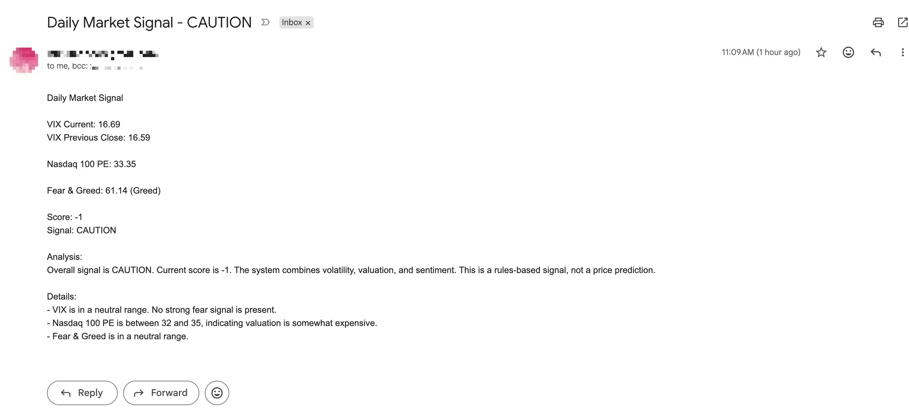
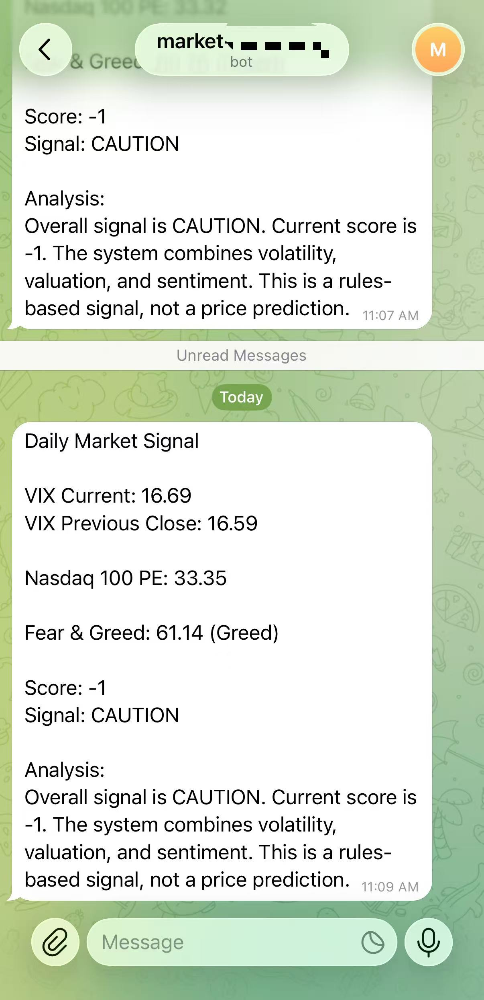

# Market Monitor Showcase

An automated market monitoring pipeline that collects multiple public market indicators, applies a rules-based scoring model, stores daily snapshots in Google Sheets, and sends market signal notifications through email and Telegram.

This project was built as a practical automation system for tracking broad market risk and opportunity signals, rather than as a static demo.


---

## Disclaimer

This project is for educational and portfolio purposes only. It is not financial advice, investment advice, or a trading recommendation.

----

## Why I Built This

Market conditions are often scattered across different public sources. Volatility, valuation, and sentiment indicators may each tell a partial story, but they are more useful when collected consistently and evaluated together.

This project automates that workflow by pulling daily market data, normalizing it into a structured format, applying a transparent scoring rule set, and sending a daily signal summary.

The system is designed to answer questions such as:

- Is the current market environment showing fear, greed, or neutrality?
- Are volatility conditions elevated or calm?
- Is Nasdaq 100 valuation expensive or relatively attractive?
- Should the current environment be treated as buy, hold, caution, or take-profit territory?

---

## System Overview

The pipeline follows a lightweight data automation workflow:

1. **Extract**
   - Collect CNN Fear & Greed Index data.
   - Fetch VIX data from Yahoo Finance.
   - Scrape Nasdaq 100 P/E data from a public valuation source.

2. **Transform**
   - Normalize each indicator into structured fields.
   - Validate values and assign source/status metadata.
   - Apply a rules-based scoring model across volatility, valuation, and sentiment.

3. **Load**
   - Append the daily snapshot into Google Sheets for historical tracking.

4. **Notify**
   - Send a daily email summary using Gmail SMTP.
   - Send Telegram notifications to configured recipients.

---

## Architecture

```text
Public Market Data Sources
   |
   |-- CNN Fear & Greed Index
   |-- Yahoo Finance VIX
   |-- Nasdaq 100 P/E Source
   |
Data Collection Layer
   |
Validation + Normalization
   |
Rules-Based Market Scoring Engine
   |
Google Sheets Historical Storage
   |
Email + Telegram Notifications
```

## Market Indicators

The current scoring model combines three indicator groups:

| Indicator          | Source                  | Purpose                             |
| ------------------ | ----------------------- | ----------------------------------- |
| VIX                | Yahoo Finance           | Measures market volatility and fear |
| Nasdaq 100 P/E     | Public valuation source | Estimates valuation risk            |
| Fear & Greed Index | CNN                     | Measures market sentiment           |

## Scoring Logic
The project uses a transparent rules-based model rather than a black-box prediction model.

### VIX
| Condition       | Score Impact | Interpretation                              |
| --------------- | -----------: | ------------------------------------------- |
| VIX > 30        |           +2 | Elevated fear, potential buying opportunity |
| 20 <= VIX <= 30 |           +1 | Moderate market stress                      |
| VIX < 14        |           -2 | Low fear, possible complacency              |

### Nasdaq 100 P/E
| Condition       | Score Impact | Interpretation            |
| --------------- | -----------: | ------------------------- |
| P/E > 35        |           -2 | Elevated valuation risk   |
| 32 <= P/E <= 35 |           -1 | Somewhat expensive        |
| P/E < 28        |           +2 | More attractive valuation |

### Fear & Greed
| Condition          | Score Impact | Interpretation |
| ------------------ | -----------: | -------------- |
| Fear & Greed > 80  |           -2 | Extreme greed  |
| Fear & Greed >= 65 |           -1 | Greed          |
| Fear & Greed < 25  |           +2 | Extreme fear   |

### Signal Mapping

| Score Range            | Signal                                    |
| ---------------------- | ----------------------------------------- |
| score >= 3             | `STRONG_BUY`                              |
| 1 <= score < 3         | `BUY_DCA`                                 |
| score = 0              | `HOLD`                                    |
| -3 < score <= -1       |  `CAUTION`                                |
| score <= -3            | `TAKE_PROFIT`                             |


## Notifications

The pipeline supports two notification channels:

- Email through Gmail SMTP
- Telegram through Telegram Bot API

Notification credentials are injected through environment variables or GitHub Secrets. No credentials are stored in the public repository.

---

## Demo / Screenshots

### Email Notification

The pipeline sends a daily market signal summary through Gmail, including VIX, Nasdaq 100 P/E, Fear & Greed score, final signal, and rule-based analysis.



### Telegram Notification

The same market signal can also be delivered through Telegram Bot API for lightweight mobile alerts.



## Future Improvements
- Add retry and fallback logic for failed data sources
- Add automated data quality checks before writing to Google Sheets
- Move indicator thresholds into a configurable rules file
- Add unit tests for the scoring engine
- Add more indicators, such as interest rates, credit spreads, or moving-average breadth
- Add CI checks for linting and schema validation